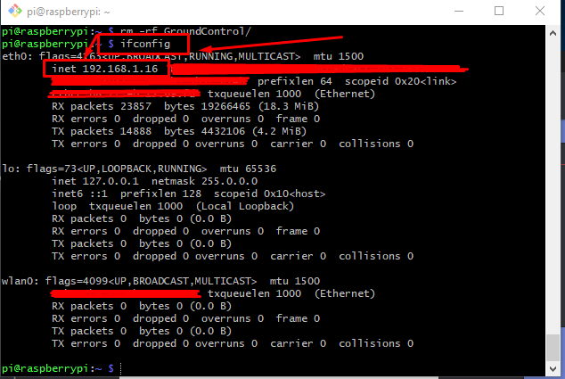
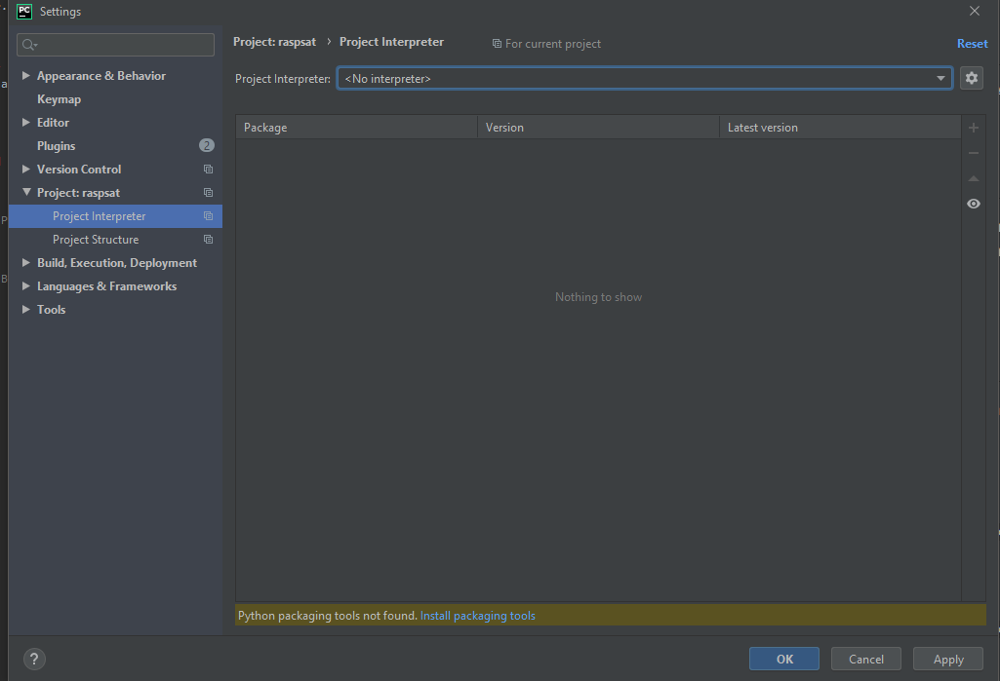
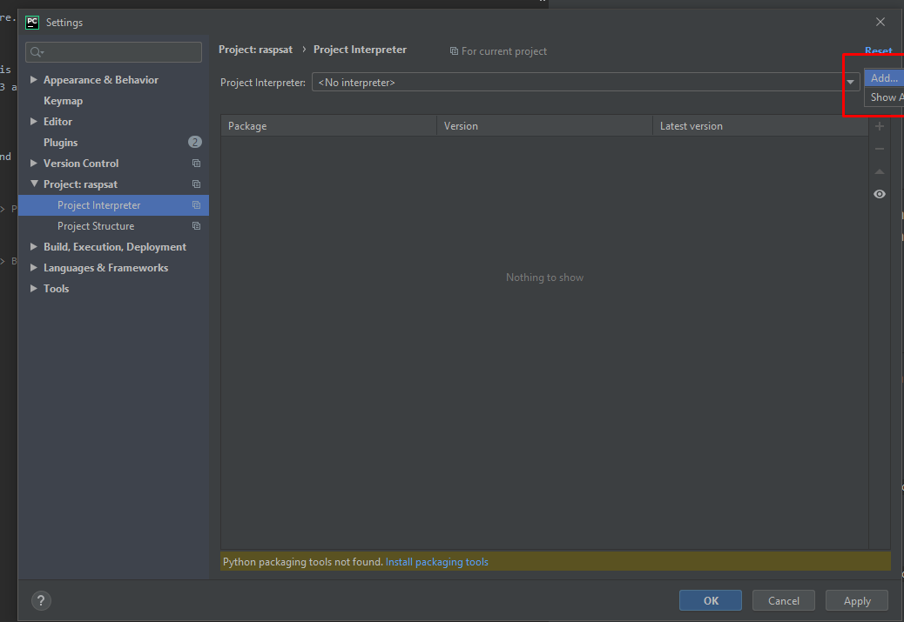
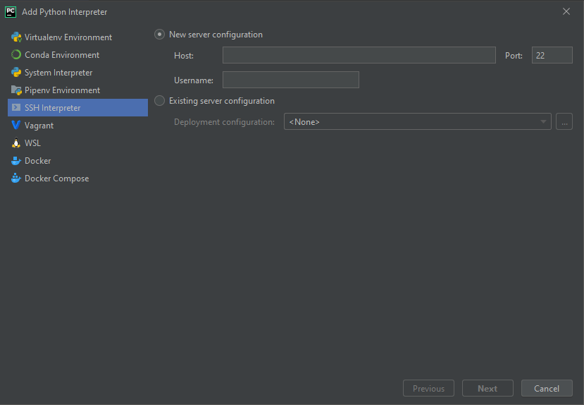
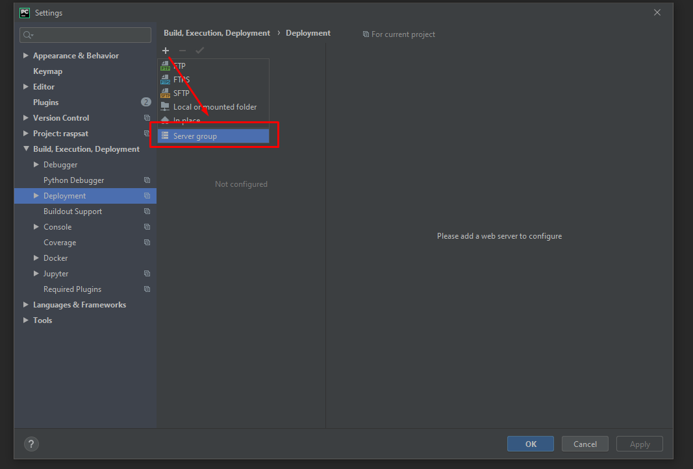
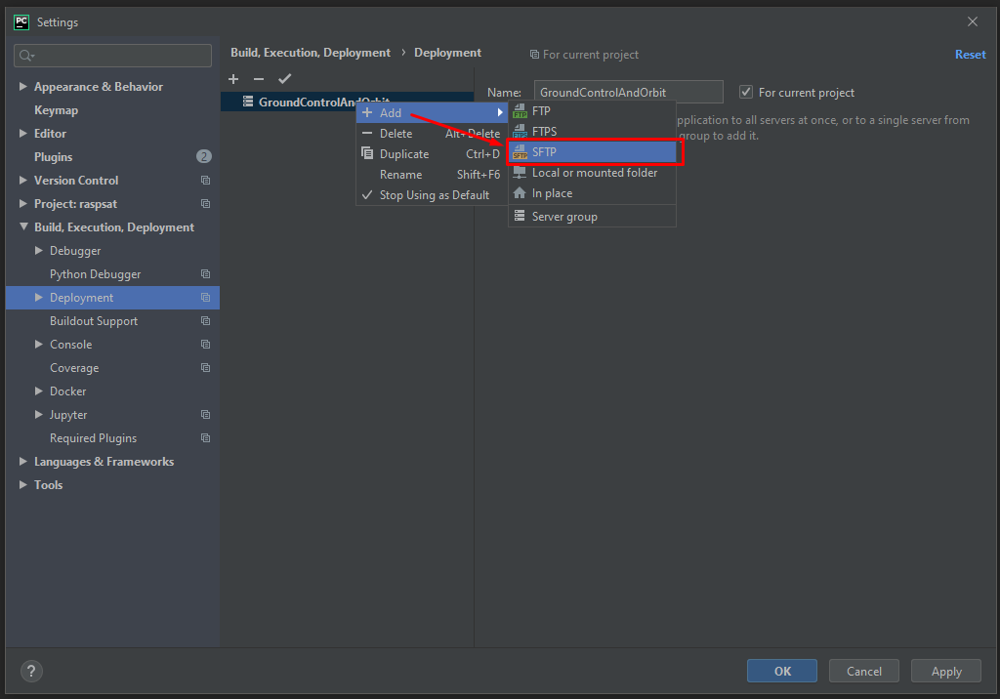
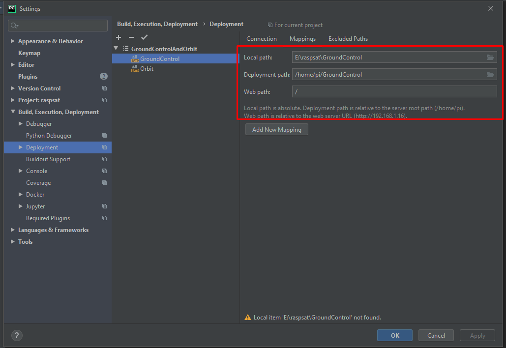

# raspsat
Raspberry pi cubesat software. Original software used Aurduinos which quickly ran out of space for the software.
## Requirements

- PyCharm Professional - This project uses PyCharm Professional for the remote interpreter
 along with deployment to both pi's. You can use other tools if you wish but you will have to set them up yourself. 
- Two raspberry pi's model 3 and up.

## Setup

* Enable ssh on both pi's and both are able to be connected to via ssh. Hook up ethernet cable, connect to wifi, etc.
* First lets get the ip's of our pi's. Ssh to both the pi's. 
Type `ifconfig` into the terminal of the pi's to get the ip.

### Setting up Interpreter

* Go to `File -> Settings -> Project: raspsat -> Project Interpreter`

* Click the cog then click add

* Click ssh Interpreter then fill in ssh details to either pi

* You will now have an interpreter to run on either of the pi's. You can alternatively use the local virtual environment
then deploy and install required packages on the pi's

### Setting Up Deployment
* Go to `File -> Settings -> Build, Execution, Deployment -> Deployment`
* Then click add Server Group

* Add the server group then right click add server

* Once you have the server add, fill in the ssh details.
* Click on Autodetect to detect the pi users home directory

* Now click the mappings tab and enter the deploy directorly along with the folder you wish to deploy

* Repeat the server steps for the second pi. You now have deployment set up for both pi's